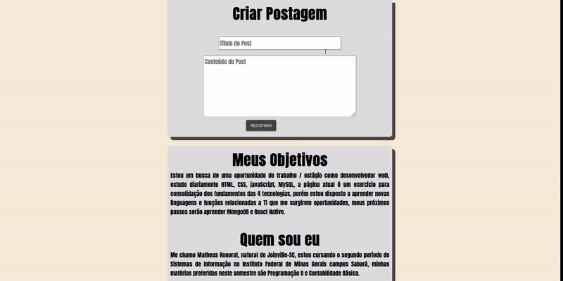
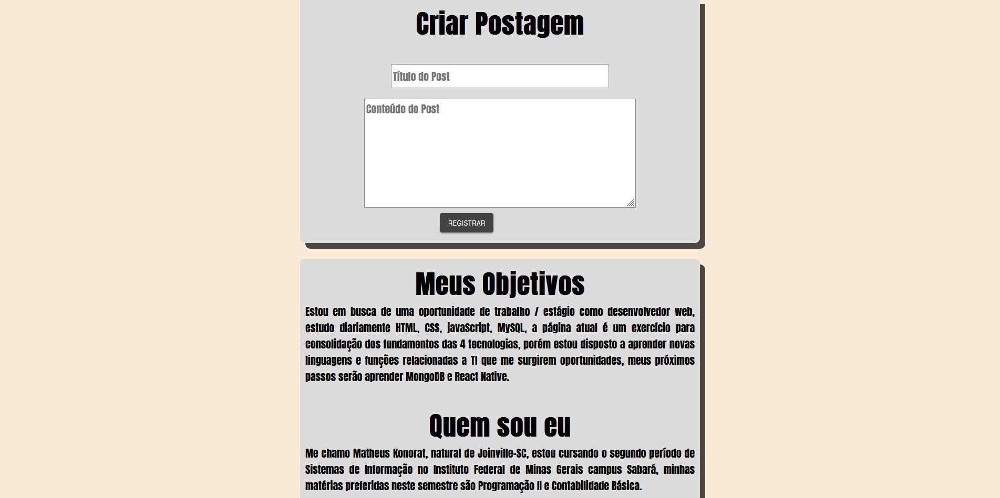
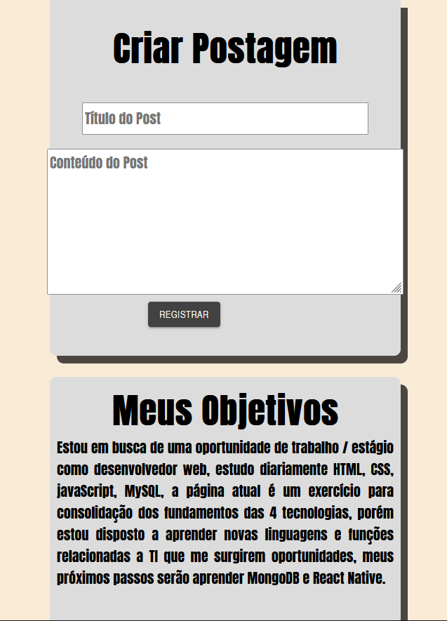

# app-postagens

# App Postagens utilizando React-Js -MySQL

  

## Descrição

Neste projeto utilizei conceitos de HTML, CSS e JS para criar uma aplicação SPA (single page aplication), aplicação de página única, onde tudo acontece
na página sem atualização, layout com CSS GRID e FlEX BOX e @media para tornar layout responsivo. Com React utilizei useState para alterar os dados, useEffect 
e props para passar os dados entre os componentes e Axios para interligar o front-end com o back-end que persiste os dados no banco MySQL com express.

- Dialog do @material-ui para o card onde edita e exlui as postagens.
- Yup para validar título e conteúdo, tornei os dois campos obrigatórios e estipulei tamanho minimo e máximo.

### Imagens

## Instalação

### Client

  1. `$ cd client`
  2. `$ npm install` or `$ yarn install`
  3. `$ npm start` or `$ yarn start`
  
### Server

  1. Mude seus dados de acesso ao banco mySQL em `server/index.js`  
  
  2. `$ cd server`
  3. `$ npm install` or `$ yarn`
  4. `$ npm rum devStart`

## Funcionalidades

+ Criar posts validando as entradas utilizando yup.
+ Editar Postagens utilizando Dialog @Material-ui.
+ Excluir postagens através do Dialog.

### Front-end
+ `React-Js`
+ `@Material-ui`
+ `formik` 
+ `yup` 
+ `axios` 

### Back-end

+ `express`
+ `mysql2`
+ `cors`
